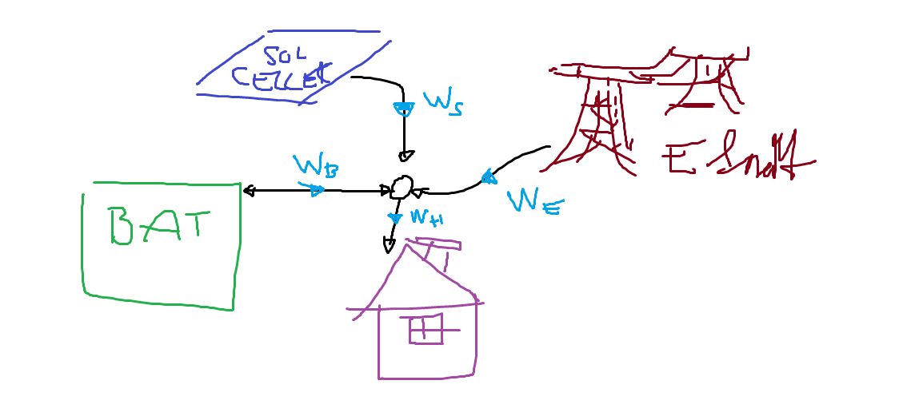

# Solar power battery optimization

## Energy-glow

We will measaure how many watts that are flowing,

* $W_S$ Wattage from the solar cells
* $W_E$ Wattage from the electric grid
* $W_B$ Wattage from the battery
* $W_H$ Wattage consumed by the house

Summing ingoing and outgoing wattage yields

$$
W_H = W_E + W_S + W_B
$$

## Power grid

The price for power consumption varies over the day, the prices are stored in a vector $C(t)$ where the price is in SEK per KWh.

The cost of power consumtion changes as

$$
\frac{d}{dt} J = C(t) \, W_E(t)
$$

I assume that the export price is not the same as the purchase prise, I added a percentage factor to accomodate for this $\eta$.

$$
\frac{d}{dt} J = \left\{
\begin{array}{cc}
C(t) \, W_E(t) & \text{if} \quad  W_E(t)>= 0\\
\eta \, C(t) \, \, W_E(t) & \text{else}
\end{array}
\right.
$$

## Battery
The charge of the battery is detoed $Q_B$ (KWh)

The *charge equation* can be described as

$$
\frac{d}{dt} Q_B = W_B(t)
$$

where $Q_B$ is limited by the min/maximum charge capacity.

$W_B(t)$ is also limited by the how fast the battery can be charged and disscharged.

## Formulation of optimization problem in discrete time

The 24h period of usage will be discretized by a *sample intervall* in which $W_B$ and $C(t)$ is assumed to be constant.

I will assume 15min.

TODO...

